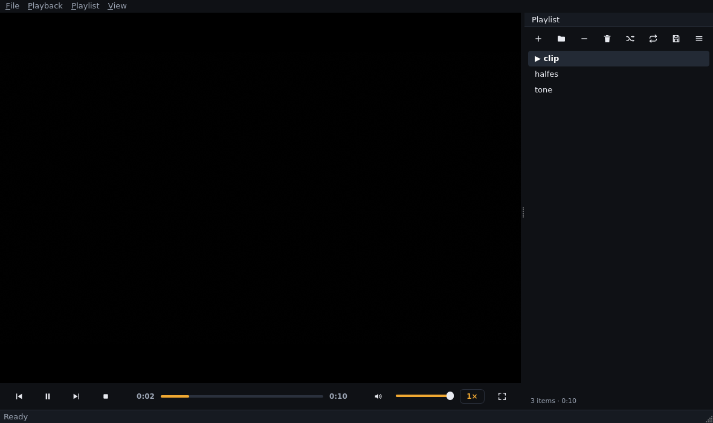

# Glint

> Formerly **Lumen** — renamed in v0.13.0 after a name-collision survey
> (several other media players are named Lumen). Same code, same licence;
> your settings migrate automatically on first run.

An original, open-source desktop media player inspired by VLC — built with
**Python**, **Qt (PySide6)** and the **libmpv** playback engine.



> Screenshot taken in a headless CI environment (software rendering — the
> video area is black there); on real GPU hardware the central area shows
> video.

> Status: **Phase 12 of 12 complete — hardware-validated on Windows (v0.13.0)**
> All planned phases delivered: player, controls, playlist, subtitles,
> media information, settings, advanced playback, network streaming,
> performance pass, packaging and polish. Real-hardware validation:
> real-GPU pixel verification PASS, Windows installer built and accepted
> through the full install/play/uninstall checklist
> ([docs/HARDWARE_VALIDATION.md](docs/HARDWARE_VALIDATION.md) §1–2, both CLOSED).
> Remaining for a public release: hosting + code signing + the macOS runs.
> See the
> [roadmap](docs/PHASE1_ARCHITECTURE.md#7-development-roadmap-mapping-your-12-phases)
> and the per-phase notes ([2](docs/PHASE2_NOTES.md), [3](docs/PHASE3_NOTES.md),
> [4](docs/PHASE4_NOTES.md), [5](docs/PHASE5_NOTES.md), [6](docs/PHASE6_NOTES.md),
> [7](docs/PHASE7_NOTES.md), [8](docs/PHASE8_NOTES.md), [9](docs/PHASE9_NOTES.md),
> [10](docs/PHASE10_NOTES.md), [11](docs/PHASE11_NOTES.md), [12](docs/PHASE12_NOTES.md)).

## Features (current)

**Playback**
- Video and audio through libmpv (FFmpeg + libass underneath): MP4, MKV,
  WebM, MOV, AVI, MP3, FLAC, Opus, OGG, WAV, AAC/M4A and more — the engine
  decides what plays, we never guess from file extensions
- Play/pause, stop, accurate seeking with a custom scrub bar
- Playback speed 0.25×–2× with audio pitch correction, via presets
- Display stays awake during playback (Windows: SetThreadExecutionState;
  released on pause/stop/quit so power settings still apply)
- Frame stepping forward/backward (one frame at a time while paused)
- Volume, mute
- Volume up to 200%, VLC-style: 100% is unity (no amplification); above it
  the engine applies software gain — the slider's amber zone and tooltip
  make it clear when you are amplified

**Playlist**
- Add files, add folders (scanned in the background), drag-and-drop files
  *and folders* onto the window
- Reorder by dragging, remove (Del), clear, double-click to play
- Shuffle and repeat (off/all/one) with VLC-style semantics
- Automatic next-track playback and skip-after-error with an error-loop guard
- Save/load M3U8 playlists (defensive parsing, relative-path resolution)
- Recent files menu (persisted)

**Subtitles**
- Embedded and external tracks (SRT, ASS/SSA, WebVTT, … — parsed and
  rendered by the engine's libass, no custom parsers)
- Automatic loading of sidecar files (`movie.en.srt` next to `movie.mkv`)
- Track selection menu, `J` to cycle, visibility toggle
- External subtitle file loading at any time
- Subtitle delay (`Z` / `X` / `Shift+Z`) with live status readout
- Appearance: size, position and color presets

**Advanced playback** (Phase 8)
- Audio track selection (Audio menu, `B` to cycle) and video track selection
  (Video menu) for multi-track files
- Selections are per-file: every new file starts from the tracks the engine
  recommends (no stale track ids silently muting the next file)
- Secondary subtitle track — displayed in addition to the primary one
- Audio sync (`-` / `+`, 50 ms steps, `Shift+-` to reset) with live status
  readout; the offset persists across files in a session (like subtitle delay)
- Screenshots of the current frame including subtitles (`S`), saved to
  Pictures/Glint (or the config folder)

**Network streaming** (Phase 9)
- Open URL… dialog (`Ctrl+U`) with scheme validation (http, https, rtsp,
  rtmp, udp, rtp, mms, ftp); dropping a URL onto the window works too
- Live buffering indicator over the video while a stream fills its cache
- ICY/Shoutcast stream titles appear in the window title and status bar as
  they change
- Network failures map to clear messages: connection refused → network
  error, HTTP 404 → not found, stalled server → timeout; unstreamable
  layouts (e.g. non-faststart MP4 over plain HTTP) → unsupported/damaged

**Performance** (Phase 10)
- Incremental playlist updates: adding, moving or removing tracks updates
  only the affected rows instead of rebuilding the view (measured on a
  10,000-entry playlist: single-row add ~240 ms → ~20 ms)
- The "now playing" marker repaints only the two rows it moves between
- Position updates are throttled to ~10 Hz with seek-jump passthrough
- Long-session stability is covered by automated leak/memory soak tests

**Media information**
- Non-blocking info dialog (`Ctrl+I`): file details, container, duration,
  estimated overall bitrate, per-track video/audio/subtitle details
  (codec, resolution, framerate, sample rate, channels, bitrates)
- Copy-to-clipboard report of everything shown

**Settings** (Phase 7)
- Non-modal settings dialog (`Ctrl+,`) that applies changes live — no
  restart, no OK button
- Five pages: playback (start volume, speed, autoplay), interface (dark/light
  theme, font scale, playlist visibility), subtitles (font, size, colour,
  delay, sidecar auto-load), audio (output device), video (hardware
  decoding, deinterlacing)
- Reset-to-defaults per the whole dialog, with unsaved-file safety
- Persisted as validated `settings.json` (atomic writes; a corrupt file
  falls back to defaults instead of failing to start)

**Interface**
- Dark/light theme, tooltips, accessible controls, responsive layout
- Fullscreen with auto-hiding controls and cursor
- Track menus show language names ("French", not "fre"); the info dialog
  shows friendly container names ("MP4 (QuickTime / MPEG-4)")
- About dialog with licence and third-party inventory (Help menu)
- One-time software-rendering warning when video falls back to software GL
- Context menus (video area and playlist)
- Playlist side panel (`Ctrl+L`), status bar feedback
- Non-blocking error banner for missing/damaged files; technical detail in
  the rotating, URL-redacting log

**Controls**
- Centralised, configurable keyboard shortcuts (`shortcuts.json`)
- Mouse: double-click → fullscreen, single-click → play/pause,
  wheel → volume, right-click → context menu

Next: hardware validation (real GPU, Windows installer, macOS) — see [docs/HARDWARE_VALIDATION.md](docs/HARDWARE_VALIDATION.md) — and a first public release review (docs/REDISTRIBUTION.md §5).

## Default keyboard shortcuts

| Key | Action |
|---|---|
| `Space` | Play / pause |
| `←` / `→` | Seek 5 s back / forward |
| `Shift+←` / `Shift+→` | Seek 30 s back / forward |
| `↑` / `↓` | Volume up / down |
| `M` | Mute |
| `F` | Fullscreen |
| `Esc` | Exit fullscreen |
| `[` / `]` / `Backspace` | Speed down / up / reset |
| `.` / `,` | Frame forward / back |
| `N` / `P` | Next / previous track |
| `J` | Cycle subtitles (off → tracks → off) |
| `Z` / `X` | Subtitle delay earlier / later (0.1 s) |
| `Shift+Z` | Reset subtitle delay |
| `B` | Cycle audio tracks (off → tracks → off) |
| `-` / `+` | Audio sync earlier / later (50 ms) |
| `Shift+-` | Reset audio sync |
| `S` | Take screenshot |
| `Ctrl+I` | Media information |
| `Ctrl+L` | Show/hide playlist |
| `Ctrl+S` | Save playlist |
| `Ctrl+O` / `Ctrl+Q` | Open file / quit |
| `Ctrl+U` | Open network stream |
| `Ctrl+,` | Settings |
| `Del` (playlist focused) | Remove selected items |

Shortcuts are configurable: create `<config dir>/shortcuts.json` (see
[`app/core/shortcuts.py`](app/core/shortcuts.py) for the format). On macOS,
`Ctrl` shortcuts map to `Cmd` automatically.

## Requirements

| | |
|---|---|
| Python | 3.12 or newer |
| GUI | PySide6 ≥ 6.6 (installed from PyPI) |
| Engine | **libmpv ≥ 0.35** (native library, installed separately — see below) |
| OS | Windows 10/11, Linux (X11 & Wayland), macOS (experimental until tested on hardware) |

## Installation

```bash
git clone <repository> glint && cd glint
python -m venv .venv
source .venv/bin/activate        # Windows: .venv\Scripts\activate
pip install -e .
```

Then install the native engine:

| OS | Install |
|---|---|
| **Windows** | Download an **mpv-dev** build (`libmpv-2.dll`, x86_64) from the mpv for Windows project (SourceForge → `mpv-player-windows` → `libmpv`) and drop `libmpv-2.dll` into the project root (or anywhere on `PATH`). |
| **Debian/Ubuntu** | `sudo apt install libmpv2` |
| **Fedora** | `sudo dnf install mpv-libs` |
| **Arch** | `sudo pacman -S mpv` |
| **macOS** | `brew install mpv` |

## Installing & running

Install from source (or from a built wheel):

```bash
pip install .             # or: pip install glint_player-*.whl
glint                     # console script; `python -m app.main` also works
```

Support options (work without a display — useful for troubleshooting):

```bash
glint --version           # print the version
glint --check             # verify engine, bundled assets and config dir
```

The wheel bundles the icon set as package data; `GLINT_ASSETS_DIR` can
override the assets location (portable installs). Windows users additionally
place `libmpv-2.dll` next to the installation (see the table below). The
self-contained Windows build and installer recipes live in
[`packaging/`](packaging/README.md); the redistribution licence review is
[`docs/REDISTRIBUTION.md`](docs/REDISTRIBUTION.md).

## Development

```bash
pip install -e ".[dev]"

# Qt-free core logic (fast, no display)
python -m pytest tests/core -q

# Engine contract tests (headless — vo/ao null)
python -m pytest tests/player -q

# GUI tests — need a display; on headless Linux:
# (pytest-timeout is included in [dev]; --timeout guards against hangs)
xvfb-run -a python -m pytest tests/ui -q --timeout=60

# Lint
ruff check app tests
```

Architecture documentation: [`docs/PHASE1_ARCHITECTURE.md`](docs/PHASE1_ARCHITECTURE.md)
(layering rules, threading laws, engine decision, licensing analysis), plus
per-phase engineering notes in `docs/`.

### Logs

`<user config>/glint/logs/glint.log` (rotating) —
`%APPDATA%\glint` on Windows, `~/Library/Application Support/glint` on macOS,
`~/.config/glint` on Linux.

### Settings

`<user config>/glint/settings.json` (same directory as the logs). The file
is validated on load — a corrupt file falls back to defaults instead of
breaking the app. `GLINT_CONFIG_DIR` overrides the whole config directory
(portable installs).

## Troubleshooting

| Symptom | Fix |
|---|---|
| `OSError: ... libmpv ...` on start | libmpv is not installed / not found — see the table above; on Windows put `libmpv-2.dll` next to the installation. Run `glint --check` to see exactly what the app finds. |
| No audio device / silent | Check system output; engine falls back automatically. Details in the log. |
| Black video with audio, on a GPU system | OpenGL problem — update GPU drivers; the app keeps playing audio by design. |
| Black video over Remote Desktop / systems without GPU drivers | Software-GL environments (RDP, `opengl32sw`) are a known limitation of mpv's renderer — see [Phase 2 notes](docs/PHASE2_NOTES.md). Play locally with hardware GL. |
| Display sleeps during playback | Not supported on this platform yet (Windows-only for now) — or the file failed and playback is not in the PLAYING state. |
| `OpenGL error INVALID_ENUM` in the log | Benign known log line on some drivers (mpv issue #15019); playback is unaffected on real GPUs. |
| Distortion at volumes above 100% | Expected: above 100% is software amplification and can clip on loud material. Lower the volume. |
| A file will not play | The banner shows the reason; the log (`glint.log`) contains the engine detail line. |

## Architecture (summary)

```
ui/            PySide6 widgets (window, video area, controls, seekbar,
               shortcuts, auto-hide, theme) — engine-agnostic
player/        backend contract (ABC) → libmpv implementation + Qt controller façade
core/          Qt-free models & logic (shortcuts, speed presets) — instant tests
utils/         logging, paths, formatting
```

Key rules: the UI only talks to `PlayerController` (signals/slots); the engine
is wrapped behind `PlayerBackend` so a future swap (e.g. libVLC) stays
contained; engine callbacks only emit Qt signals — they never call back into
the engine (deadlock rule).

## License

GPL-3.0-or-later — see [`LICENSE`](LICENSE). Glint bundles/uses open-source
components at runtime (PySide6 LGPL-3, libmpv GPLv2+, python-mpv) whose
notices apply to redistributions; the full licensing analysis lives in the
Phase 1 document and will be re-reviewed at packaging time.

Glint is an independent project and is not affiliated with, endorsed by, or
derived from VLC, VideoLAN, or the mpv project beyond their use as libraries.
