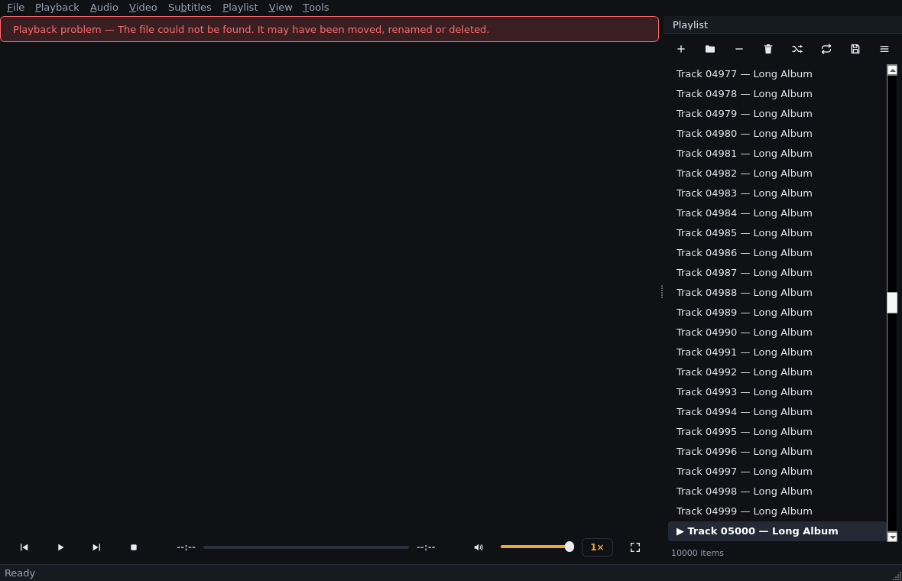

# Phase 10 — Engineering notes (2026-09-18)

## What was done

A measurement-first performance pass over the four areas the roadmap named:
startup, playlist-model updates, position/seek signalling, and long-session
stability. Two real bottlenecks were found (both in the playlist path) and
fixed; the other two areas were verified to already be sound and are now
pinned by tests.

## Measurements (2-CPU sandbox, Xvfb/llvmpipe, real QListView attached)

| Operation, 10,000-row playlist | Before | After | Change |
|---|---|---|---|
| Bulk add 10,000 rows | 319 ms | 56 ms | **5.7×** |
| Add 1 row | 241 ms | 19 ms | **12.6×** |
| Move block of 50 | 290 ms | 22 ms | **13×** |
| Remove block of 50 | 255 ms | 19 ms | **13×** |
| Track change (marker repaint) | all rows | 2 rows | O(n) → O(1) |

Startup (measured, no change needed): module import ~200–350 ms (PySide6
dominates), `Application()` construction ~30–36 ms, window show under Xvfb
≈ 100 ms — comfortably inside a 1 s budget before the first paint on real
hardware.

## Root causes found

1. **Every playlist mutation reset the model.** The queue emitted a coarse
   `itemsChanged` for add/remove/move/load, and the model answered with
   `beginResetModel/endResetModel` — a full view teardown per change.
2. **The view re-laid-out on every change**: `QListView` without
   `uniformItemSizes` recomputes item geometries per structural change.
3. **The "now playing" marker repaint was O(playlist)**: `currentChanged`
   emitted `dataChanged` spanning *all* rows, twice per track change.

## Changes

- **`app/player/queue.py`** — fine-grained structural signals in addition to
  `itemsChanged` (which stays for the cheap footer listener):
  `rowsAboutToBeInserted/rowsInserted(first, last)`,
  `rowsAboutToBeRemoved/rowsRemoved(first, last)` (contiguous removals),
  `rowsAboutToBeMoved/rowsMoved(first, last, destination)`
  (single-block moves), `playlistAboutToBeReset/playlistReset` (load/clear).
  Mutations that cannot be expressed as one contiguous span (scattered
  remove, multi-span drag) intentionally keep the reset fallback — same cost
  class as before, no regression, correct by construction.
  Move destinations use Qt's own old-numbering drop semantics ("the block
  lands before old row N") — verified against the `beginMoveRows` docs
  example; a first implementation that translated to post-removal numbering
  silently broke downward moves (caught by the new tests).
- **`app/ui/playlist_model.py`** — the begin*/end* calls map 1:1 onto the
  new signal pairs; the model resets only on the fallback path. The current
  marker is tracked (`_current_row`) and reconciled after every structural
  change (inserts above the current row shift it without a `currentChanged`
  signal), repainting exactly the two affected rows. Root `flags()` now
  returns exactly `ItemIsDropEnabled` — Qt's own `QAbstractItemModelTester`
  requires precisely that for the parent of drag-enabled rows (and it is
  what Qt's StringListModel example does).
- **`app/ui/playlist_panel.py`** — `view.setUniformItemSizes(True)` (all
  rows are single-line items of equal height).
- **`app/player/controller.py`** — the backend is injectable
  (`backend_factory`) so the position throttle is unit-testable without an
  engine. No behaviour change; `Application` is untouched.

## What was verified sound (no change needed)

- **Position/seek signalling**: the controller already throttles to ~10 Hz
  with a 1 s jump-passthrough (`_POSITION_EMIT_INTERVAL` /
  `_POSITION_JUMP_THRESHOLD`, Phase 3). It now has direct unit tests
  (previously untested — found by this pass).
- **Startup**: nothing silly in the composition root; no I/O beyond the
  settings file and log setup.
- **Menus**: track/subtitle menus were already lazy (`aboutToShow`-
  populated) — confirmed, no work needed.
- **Seek smoothness under load**: engine seeks remain async; the throttle
  guarantees ≤ 10 GUI wakeups/s regardless of engine tick rate.

## Test infrastructure

- `tests/ui/test_playlist_model.py` +11: incremental insert (incl. front
  insert with `QPersistentModelIndex` survival), contiguous remove,
  scattered remove fallback, block move, move-onto-itself emitting nothing,
  scattered move fallback, load reset, two-row marker repaint, marker
  correctness after insert-above-current, and a full
  `QAbstractItemModelTester` validation across every mutation kind.
- `tests/player/test_controller_throttle.py` (4): burst throttling, jump
  passthrough, interval re-emission, constant sanity.
- `tests/ui/test_performance_ui.py` (3): mutation budgets at 10× margin
  (10k bulk add < 3 s; single add/move/remove < 300 ms), a 12-cycle
  open/stop soak asserting zero widget-tree growth (the Phase 7 leak class),
  and a playlist-churn memory soak (tracemalloc, Python-side, loose budget).

## Verification status

| Suite | Result |
|---|---|
| `ruff check app tests` | clean |
| `tests/core tests/player` | **164 passed** (4 new throttle tests) |
| `tests/ui` (full, default order) | **96 passed — 3 consecutive runs** |
| **Total** | **260 passed** |

Video-pixel verification on real GPU hardware remains open (llvmpipe
limitation, Phase 2 notes) — not a code defect.

## Known limitations

- Scattered removes / multi-span drags still reset the model (measured cost
  unchanged from Phase 9 behaviour; single-span covers the common cases).
- Shuffle still rebuilds the play order (documented Phase 4 behaviour).
- The sandbox numbers are software-rendered; real-GPU seek/scroll feel
  needs the Phase 12 hardware pass.
- `tracemalloc` sees Python allocations only — Qt C++ internals are not
  covered by the memory soak.

## Next step

Phase 11 — packaging: PySide6 + libmpv bundling strategy per platform
(libmpv-2.dll on Windows via the documented download, dylib on macOS,
system libmpv on Linux), `pip install`/wheel build, entry points, the
redistribution licensing review promised in Phase 1 (GPL-3.0-or-later
compatibility of every bundled component), and start-menu/shortcut/installer
artefacts for Windows.
