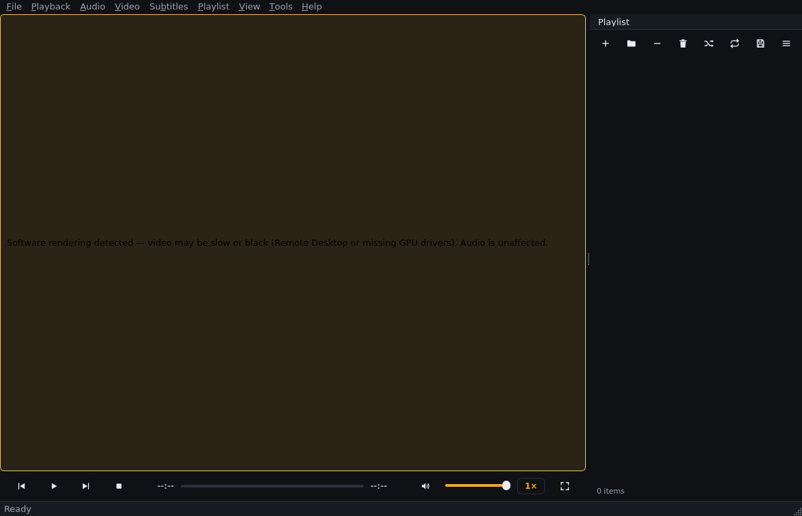

# Phase 12 — Engineering notes (2026-09-18)

## What was done

The final phase: polish items accumulated since Phase 2, plus the tooling
that turns "needs real hardware" from a vague promise into a repeatable
procedure. All 12 planned phases are now complete.

## Polish items delivered

1. **Language names in track menus** (`app/core/languages.py`, Qt-free):
   ISO 639-2/B + 639-1 codes → English names ("fre" → "French", ~140
   entries incl. the special matroska markers `und`/`mul`/`zxx`). Unknown
   codes pass through uppercased — honest, never dropped. Wired into
   `TrackInfo.display_name`, so Audio/Video/Subtitle menus and the info
   dialog all show names.
2. **Friendly container names** (`format_container_name` in
   `core/media_info.py`): the raw FFmpeg probe lists are mapped for display
   ("mov,mp4,m4a,3gp,3g2,mj2" → "MP4 (QuickTime / MPEG-4)"); unknown values
   pass through unchanged. `MediaDetails.container` keeps the raw engine
   fact; prettifying is presentation-only (info dialog + text report).
3. **Software-GL warning**: the engine's "Suspected software renderer" log
   line (observed under llvmpipe/Remote Desktop) now surfaces a dismissible
   notice strip over the video, once per session
   (`PlayerController.softwareRenderingDetected`, emitted from `on_log`
   exactly once; `VideoArea._renderer_notice`). New `warning`/`warning_bg`
   theme tokens carry it in dark and light themes.
4. **About dialog** (Help → About Lumen, plus About Qt): version, GPL-3.0-or-later
   statement, third-party inventory mirroring `docs/REDISTRIBUTION.md`.
   Non-modal, cached like the other dialogs.
5. **Erratum**: PHASE6_NOTES totals line corrected (160 → 182, with a note).
   Development-Status classifier bumped to *Beta*.

## Hardware validation tooling

- **`dev/verify-video.py`** — the real-GPU pixel check, finally automatable:
  plays a synthetic clip through the actual render path, then captures
  **two independent images**: the engine's own screenshot (proves decode)
  and the QOpenGLWidget framebuffer (proves pixels reach the screen). This
  distinction matters and was discovered the honest way: mpv's screenshot
  bypasses the display path entirely, so a first version of the tool
  **passed under llvmpipe while the screen was black** — a false positive.
  The dual capture diagnoses precisely; verified in this sandbox:
  `engine decode frame: 100% non-black … on-screen framebuffer: 0.0%
  non-black, 1 coarse colour → FAIL (exit 1)` — exactly the documented
  sandbox limitation, now machine-checked instead of asserted by hand.
  (Also fixed en route: the cleanup must `surface.release()` *before*
  `backend.shutdown()` — terminating libmpv with a live render context
  aborts the process by design.)
- **`dev/release-check.sh`** — one command for everything CI-able: lint,
  full test suites, wheel build + installed `--check` smoke, branding guard
  (no VLC references in shipped code/assets), GPU verdict (informational).
- **`docs/HARDWARE_VALIDATION.md`** — concrete procedures with expected
  outputs for the three remaining human steps: real-GPU verification,
  Windows packaging validation (libmpv placement, installer incl.
  file-association and uninstall-preserves-config checks, high-DPI focus
  areas), and macOS validation.

## Verification status

| Suite | Result |
|---|---|
| `ruff check app tests` | clean |
| `tests/core tests/player` | **179 passed** (7 new: 5 language + 2 container) |
| `tests/ui` (full, default order) | **101 passed — 3 consecutive runs** |
| **Total** | **280 passed** |
| `dev/verify-video.py` (sandbox/llvmpipe) | FAIL as expected, correct diagnosis, exit 1 |
| `dev/release-check.sh` | all automated steps green |

## Known limitations (final state)

- Real-GPU, Windows-installer and macOS validation remain open — by
  necessity (no such hardware here); each now has a procedure with expected
  outputs in `docs/HARDWARE_VALIDATION.md`.
- Scattered playlist removes still reset the model (documented Phase 10
  fallback); shuffle rebuilds play order (Phase 4 design).
- ICY titles update window/status, not playlist rows (Phase 9 design).
- No proxy configuration UI; `--check` proves library load, not playback.

## Project close-out

Twelve phases delivered with approval gates, 280 automated tests, honest
verification records for everything not verifiable in the sandbox, GPL
compliance documented end-to-end (REDISTRIBUTION.md), and a one-command
release check. The codebase stands at ~282 tests green, lint clean, v0.12.0.

## Next step

Hardware validation per `docs/HARDWARE_VALIDATION.md`, then the first
public release: the human checklist in `docs/REDISTRIBUTION.md` §5
(licence texts, source offers, `--check` green on every platform) — and
the decision whether to publish the wheel to PyPI.

## Field fix (v0.12.1, from first Windows run)

The first real Windows run found an import-order bug: python-mpv checks at
**import time** that `mpv-1.dll`/`mpv-2.dll`/`libmpv-2.dll` is on `%PATH%`,
but our libmpv loader only ran *after* `import mpv` — so the documented
"drop `libmpv-2.dll` into the project root" install could never work (the
import crashed first, with a raw traceback even for `--check`). Fixed:

1. `mpv_backend.py` now prepends the project root (or frozen-exe dir) to
   `%PATH%` and registers it with `os.add_dll_directory` **before**
   `import mpv`.
2. `main.py` imports the application lazily, so `--version`/`--check` work
   on machines without the engine; the Windows branch of `--check` probes
   the project root itself and prints exact placement instructions on
   failure instead of crashing.
3. Regression test: `app.main` must not import `app.application` at module
   level (runs engine-free in CI).

Verified after the fix: lint clean, core+player **180**, UI **101**.

## Field fix (v0.12.2)

First Windows run of 0.12.1 reached `--check` but the engine row reported
"found libmpv-2.dll but could not load it (or one of its dependencies)".
v0.12.2: `--check` now (a) retries the load with legacy search order
(`winmode=0`, which also consults %PATH% for dependencies), (b) probes the
common runtime dependencies (MSVC: msvcp140/vcruntime140/vcruntime140_1;
MinGW: libwinpthread-1/libgcc_s_seh-1/libstdc++-6) and names the missing
one with its fix (typically the VC++ 2015-2022 x64 redistributable), and
(c) flags suspiciously small dll extracts (official builds are ~70-80 MB).
The import-time loader in `mpv_backend.py` gained the same `winmode=0`
fallback.

## Field fix (v0.12.3)

With the engine dll present, `--check` (0.12.2) reported the likely missing
MinGW runtimes but could not prove *which* imports the dll actually needs.
v0.12.3 adds a pure-stdlib **PE import-table parser**
(`_pe_imported_dlls`): the failure report now lists the dll's actual
imports, names exactly the missing ones (each with its fix), and checks the
dll's architecture against the running Python (catches e.g. an ARM64 build
downloaded for x64 Python). Also fixed en route: the arch check now
understands Linux `x86_64` machine names (caught by the new unit tests,
which build a synthetic PE32+ file byte-by-byte — no Windows needed in CI).

## Field fix (v0.12.4)

First real-GPU playback on Windows (0.12.3): video played **upside down**.
Root cause: `MpvVideoSurface` rendered with `flip_y=False`. mpv's render
API draws the image with its first row at the TOP of the target
(texture-toolkit convention); `QOpenGLWidget` presents its framebuffer
with standard bottom-left-origin GL semantics — so mpv's default
orientation lands vertically mirrored and the surface must request
`flip_y=True`. The sandbox never caught it: under llvmpipe the framebuffer
readback is black (precisely the gap `dev/verify-video.py`'s dual capture
exists for), so orientation was never observable before real hardware.
Also in 0.12.4: `--check` gained `vulkan-1.dll` advice (the actual missing
dependency on the field machine, found by the v0.12.3 import-table
parser), and `dev/verify-video.py` no longer needs ffmpeg — it plays a
bundled vertically asymmetric clip and FAILs explicitly on flipped images,
making it a permanent orientation gate.

## Field fix (v0.12.5) — post-validation polish from the Windows run

Two findings from the first real playback session, plus the §1 closure:

1. **§1 real-GPU validation: CLOSED.** verify-video on the field machine:
   decode 100% non-black; framebuffer 100% non-black, 9 coarse colours,
   orientation upright — PASS (v0.12.4).
2. **Display slept during playback.** New `app/player/keep_awake.py`:
   `DisplayKeepAwake` holds `SetThreadExecutionState(ES_CONTINUOUS |
   ES_SYSTEM_REQUIRED | ES_DISPLAY_REQUIRED)` while PLAYING and releases
   on every other state + shutdown. Driven by the controller's own
   `stateChanged` signal so the per-thread Windows call runs on the GUI
   thread. Linux/macOS are documented no-ops (untested there — project
   rule: no claims beyond what is validated).
3. **Fullscreen left the playlist dock visible.** `_enter_fullscreen`
   now hides the dock (video-only view, per spec) remembering its prior
   state; `_exit_fullscreen` restores it; inside fullscreen the panel is
   chrome — Ctrl+L shows it, the idle auto-hide hides it again with the
   control bar and cursor.

Tests: 296 = 192 core/player (5 new keep-awake) + 104 UI (3 new
fullscreen-panel).

## Field feature (v0.12.6) — VLC-style 200% volume

Requested during the Windows field session. Design: 0..200% range with
100% as unity — above it the engine applies digital gain (the same
trade-off VLC makes; loud material may clip). Implementation:
`volume-max=200` libmpv option (mpv otherwise caps amplification at its
own default of 130), `clamp_volume`/`VOLUME_UNITY`/`VOLUME_MAX` in
app.core.playback shared by backend, controller and settings
(default_volume cleaner widened to 0..200), a new `VolumeSlider`
(custom-painted QSlider following the SeekBar precedent: accent fill to
unity, warning-coloured zone beyond, "amplified — may distort" tooltip;
native click/drag/wheel/keyboard behaviour unchanged), and the settings
dialog slider widened to 200 with a %-label. Tests: 302 = 197 core/player
(+5) + 105 UI (+1).

## Packaging validation (v0.12.7) — PyInstaller recipe executed for the first time

Prepared the §2 Windows installer track. The never-executed recipes were
run on Linux first (the whole point: catch breakage here, not on the
user's machine) and caught three real bugs plus needed updates:

1. `Analysis(["app/main.py"])` — relative script paths resolve against the
   spec's directory, not the CWD; build failed from the documented
   invocation. Now absolute via the spec's `root`.
2. `root = Path(SPECPATH).parents[1]` — off by one (SPECPATH is the spec
   *directory*); every data path would have been wrong.
3. `asset_dir()` frozen pointed next to the exe, but PyInstaller 6 places
   bundled data in `_internal` (= `sys._MEIPASS`): the frozen app would
   have found zero icons (and the bundled dll would not have been probed;
   the loader now probes `_MEIPASS` as well as the exe dir).
4. `console=False` swallowed `--check` output in frozen mode;
   `main._attach_parent_console()` now attaches to the parent console on
   Windows-frozen CLI runs.
5. New `packaging/exe-version.txt` (exe version resource), a generated
   7-frame `app.ico` (SVG is not a valid Windows exe icon), libmpv-2.dll
   auto-bundling from the repo root, installer bumped off its stale 0.11.0
   pin with a stable AppId, licence texts shipped into `doc\`, and a
   post-install Vulkan-runtime warning; `test_release_versions_agree`
   pins all four version locations.

Validation achieved on Linux: `pyinstaller packaging/lumen.spec` builds
clean; frozen `Lumen --version`/`--check` PASS (icons resolved from
`_internal/assets/icons`, engine bundled); frozen GUI smoke under Xvfb
reaches "Lumen 0.12.7 ready" with zero tracebacks. Tests: 305 = 200
core/player + 105 UI. Remaining for §2 (Windows-only): exe icon/version
embed, console attach, dll bundling, `iscc` installer compile + install/
uninstall checklist.

## Field fix (v0.12.8) — frozen --check printed nothing on Windows

First Windows execution of the PyInstaller build: the frozen player ran
perfectly (GUI, engine, icons — the bundle is validated), but
`Lumen.exe --check` produced no output. Root cause, provable from the
code: `_attach_parent_console` opened `CONOUT$` with `closefd=False`,
which Python rejects with ValueError for *filename* arguments (only file
descriptors may keep closefd=False); the broad except swallowed it, so
stdout was never rebound and every print vanished. Untestable in the
Linux sandbox (the function no-ops off-Windows) — caught by the field.
Fix: drop closefd, rebind stdout/stderr/stdin to the console devices
plainly. Also bumped the four release version locations to 0.12.8.

## Field fix (v0.12.8, installer script) — missing DefaultDirName

First Windows compile of windows-installer.iss aborted: the v0.12.7
rewrite of the [Setup] section accidentally dropped Inno's REQUIRED
`DefaultDirName`/`DefaultGroupName` directives. Re-added, plus
`PrivilegesRequiredOverridesAllowed=dialog` (per-machine or per-user
install at the user's choice — {autopf} follows automatically).
`test_installer_script_basics` now asserts all required [Setup]
directives so a rewrite can never drop them silently again.

## Field fix (v0.12.8, installer script #2) — association include used an uncallable macro

Second first-compile finding: `assoc-extensions.iss.inc` contained bare
`AssocExt(mkv)` macro calls, which Inno's [Registry] section parser reads
as parameter names ("Unrecognized parameter name"), and the #define body
itself was not a valid ISPP string expression. Root-cause fix: deleted the
macro indirection entirely — the include now carries one plain [Registry]
line per extension (18: 9 video, 7 audio, 2 playlist containers), each
HKCU, uninsdeletevalue, gated on the optional fileassoc task. The test
suite now pins the include's structure so macros cannot creep back.

## Field fix (v0.12.8, installer script #3) — PrivilegesRequired default

Third first-compile finding: without an explicit `PrivilegesRequired`,
Inno defaults to "admin" and warns (UsedUserAreasWarning) because the
script writes per-user HKCU associations — in an elevated install those
writes risk landing in the elevating account's profile. Fix:
`PrivilegesRequired=lowest` (Lumen needs no admin) while keeping
`PrivilegesRequiredOverridesAllowed=dialog` so an all-users install
remains a deliberate choice. Regression test pins the directive.

## Section 2 CLOSED (2026-09-22) — Windows installer validated end-to-end

Field results: frozen --check PASS; installer compiled (Inno Setup
6.7.3, per-user, PrivilegesRequired=lowest); acceptance checklist all
green — install with GPL licence page, playback + fullscreen + panel +
200% volume, icons, no Vulkan warning, uninstall preserved
%APPDATA%\lumen, reinstall OK. The hardware-validation track (§1 real
GPU, §2 packaging) is complete; macOS (§3) remains future work.
Release announcement drafted in docs/RELEASE-ANNOUNCEMENT.md (libmpv
provenance + GPL source offers = the final redistribution checkpoint).

## Rename (v0.13.0) — Lumen → Glint

A category name-collision survey (media players named "Lumen": an
established cross-platform player at lumenplayer.net self-described as
"the modern alternative to VLC", a GitHub Lumen-Video-Player using the
mpv engine, iOS/macOS players, a Plex client, an IPTV app) showed the
name was too crowded to publish under. Candidates were verified by
search before adoption; VLX was rejected (an existing VLC-clone app
name, plus VideoLAN's registered VL- trademark family), and Glint was
chosen: 5 letters, "a flash of light" — continuous with the original
light theme and the amber-on-dark icon, and unclaimed in category.

Scope of the rename (v0.13.0): package name glint-player (console
script `glint`), app strings/window titles/About, logger namespace
glint.* and glint.log, screenshot prefix glint-*.png and Pictures/Glint,
drag-and-drop MIME application/x-glint-playlist-rows, PyInstaller spec
packaging/glint.spec producing Glint.exe (new installer AppId — the
product never publicly shipped under the old one), file associations
Glint.MediaFile, env overrides GLINT_*_DIR with LUMEN_* legacy
fallbacks, and an automatic one-time migration that copies a legacy
%APPDATA%/lumen (~/​.config/lumen) config directory onto the new glint
one so settings, recents and logs survive the rename. Historical phase
notes and quoted field outputs keep the Lumen name deliberately — they
are records, not runbooks.

### Rename field confirmation (2026-09-22)

v0.13.0 applied and validated on the Windows field machine: editable
install refreshed (glint-player), `python -m app.main` runs as Glint,
PyInstaller rebuild produced dist\Glint\Glint.exe with --check PASS, and
Inno Setup compiled GlintSetup-0.13.0.exe successfully. The rename
track is closed.

## Field fix (v0.13.1) — default-player support

Field report: "how do I make Glint my default video player — it is not in
the list of players?" Two root causes, both fixed:

1. Glint.exe ignored positional file arguments: main() handled only
   --version/--check, so a double-clicked or "Open with"-launched file
   opened an empty player. Added `_collect_media_args` +
   `MainWindow.open_uris()` — launch args queue and auto-play (tested).
2. The installer never registered Glint with Windows' Default-apps
   system, so it could not appear in Settings → Apps → Default apps.
   The script now writes the standard Capabilities +
   RegisteredApplications entries (HKCU, 18 extensions, uninstall-cleaned)
   — a pure listing until the user deliberately picks Glint in Settings.
