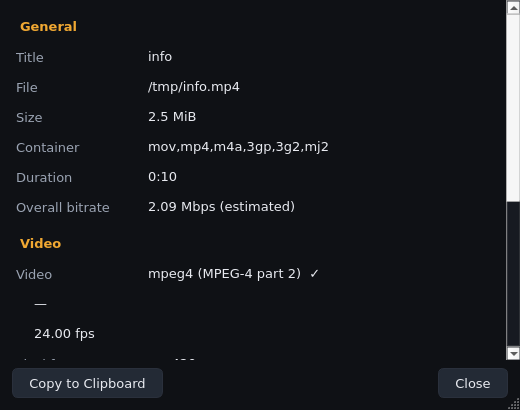

# Phase 6 — Engineering notes (2026-09-17)

## What was added

- **Media Information dialog** (`app/ui/dialogs.py`, non-modal — playback
  continues while it is open): General section (title, file path, size,
  container, duration, estimated overall bitrate), Video section (codec +
  friendly name, resolution, framerate, demux bitrate, pixel format and
  display aspect of the selected track), Audio section (codec, sample rate,
  channels + layout, language, demux bitrate), Subtitles section (embedded
  and external tracks). Multi-track media lists every track; the selected
  one is marked ✓.
- **Copy to Clipboard** — puts a plain-text report (same layout as the log)
  on the clipboard. The report builder lives in core and is unit-tested.
- **Ctrl+I** shortcut, Tools menu entry, and a video-area context-menu entry.
- The dialog refreshes automatically when a new media loads while open.

## The probe-vs-dependency decision (promised in Phase 1)

Phase 1 reserved the option of a metadata prober (PyAV or an ffprobe
subprocess). This phase closed that decision: **everything the spec asks for
is available from libmpv directly**, so no new dependency is needed:

| Spec item | Engine source (verified against libmpv 0.40) |
|---|---|
| Filename / path / size | `filename`, `path`, `file-size` |
| Container | `file-format` (`mkv`, `wav`, …) |
| Duration | `duration` |
| Video codec / resolution / fps | `track-list` demux fields (`codec`, `codec-desc`, `demux-w/h`, `demux-fps`) |
| Pixel format / aspect | `video-params` (`pixelformat`, `aspect-name`) |
| Audio codec / rate / channels | `track-list` (`demux-samplerate`, `demux-channel-count`, `demux-channels`) |
| Bitrates | per-track `demux-bitrate`; overall estimated as `size × 8 / duration` |
| Subtitle tracks | `track-list` with external flag |

Consequences: no PyAV (BSD wheel licensing question moot), no ffprobe
subprocess (no process/security surface), everything stays behind the
existing backend abstraction. If a future need arises (e.g. inspecting a
file *without* loading it), `core/probe.py` can still be added with its own
license review.

## Design notes

1. **Snapshot-on-demand, not events.** The dialog asks
   `controller.media_details()` when shown/refreshed — property reads are
   cheap; no background probing or polling. `MediaDetails` is a frozen
   dataclass in core (`core/media_info.py`) with helpers
   (`selected_or_first`, `estimate_overall_bitrate`, `format_details_report`)
   that are pure and unit-tested.
2. **`TrackInfo` grew demux-level fields** (`width`, `height`, `framerate`,
   `sample_rate`, `channels`, `channel_layout`, `bitrate`) — engine-agnostic
   and reusable (Phase 8's track menus can show "1920×1080" labels).
3. **Numbers are formatted in `utils/format.py`** (`format_size` IEC units,
   `format_bitrate`) — also unit-tested. `format_size(0)` deliberately
   returns "0 B" (a fact) while `None` returns "—" (unknown); a test caught
   the first version conflating them.
4. The backend's `media_details()` is best-effort and never raises: any
   unavailable property degrades to `None`.

## Test coverage added

- `tests/core/test_media_info.py` (7) — section filters, selected-or-first,
  bitrate estimate, full report content, empty/media-specific reports.
- `tests/core/test_format_utils.py` (3 parametrized) — size/bitrate/time
  formatting edge cases.
- `tests/player/test_media_details.py` (3, real engine) — audio-file and
  video-file snapshots (container, exact file size, per-track demux values,
  `video-params` extras) and the idle/empty contract.
- `tests/ui/test_media_info_dialog.py` (5) — dialog sections populated,
  clipboard copy, refresh-on-new-media, idle placeholder, report integrity.

Totals: **182 tests green** (98 core, 26 player, 58 UI); lint clean.
*(Erratum corrected in Phase 12: this line previously said 160; the
Phase 6 total was 182 all along.)*

## Misc

- One transient UI-suite failure was observed once under Xvfb load and did
  not reproduce in three subsequent full runs; timing-sensitive engine
  tests carry generous timeouts. If it recurs, the test name will guide a
  targeted margin fix.
