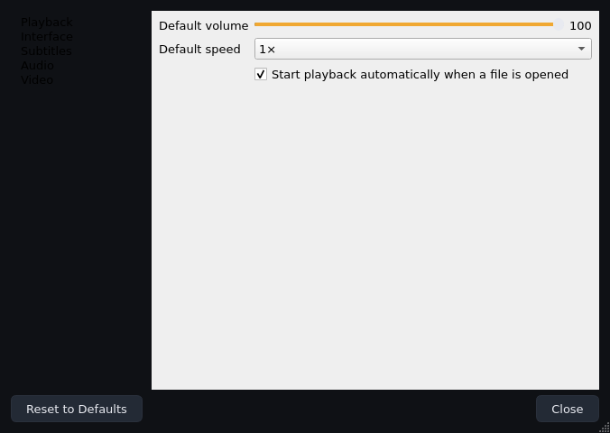

# Phase 7 — Engineering notes (2026-09-17)



## What was added

- **Persistent, validated settings** (`app/core/settings.py`, Qt-free):
  `AppSettings` + five section dataclasses (Playback, Interface, Subtitles,
  Audio, Video), a validator table (`_FIELD_VALIDATORS`), a defensive
  `from_dict` that survives unknown keys/types/schema drift, and
  `SettingsStore` with **atomic writes** (temp file + `os.replace`). A corrupt
  file logs a warning and falls back to defaults — the app always starts.
- **SettingsService** (`app/settings_service.py`): the only writer.
  `apply(settings)` persists atomically and emits `changed(settings)`;
  `reset_to_defaults()` is `apply(AppSettings())`. Save failures never raise
  into the UI (logged, status bar notice).
- **Live settings dialog** (`app/ui/settings_dialog.py`): non-modal, cached on
  the main window, **applies on every change** (no OK button). Five pages:
  - *Playback*: start volume, startup speed (presets), autoplay-on-open
  - *Interface*: dark/light theme, font scale (9/10/12 pt), playlist visible
    at start
  - *Subtitles*: font, size, colour (swatch), delay, sidecar auto-load
  - *Audio*: output device (combo, populated from `audio_devices()`,
    "(unavailable)" placeholder when the engine can't enumerate)
  - *Video*: hardware decoding, deinterlacing
  A `_loading` guard prevents populate() from feeding values back through
  `apply()`. Reset-to-defaults button re-applies everything live.
- **Engine-option endpoints** on the backend ABC (`set_audio_device`,
  `audio_device`, `set_hardware_decoding`/`hardware_decoding`,
  `set_deinterlace`/`deinterlace`, `set_sub_auto_load_external`) with mpv
  implementations and readback normalisation (see quirks below), passed
  through `PlayerController`.
- **`Ctrl+,`** shortcut and Tools → Settings… menu entry.
- **`autoplay_on_open`** on the controller: when off, `open()` loads paused
  (also applies to queue auto-advance and next/prev — one policy, one place).
- **`LUMEN_CONFIG_DIR`** environment override + platform-correct config/log
  directories in `app/utils/paths.py` (also used by tests for isolation).
- **Theme engine** (`app/ui/theme.py`): `LIGHT` tokens, `THEMES` map,
  `FONT_SCALES {0.9, 1.0, 1.2}`, and `apply_theme(qapp, theme, font_scale)`.

## The settings flow (architecture decision)

```
dialog  →  SettingsService.apply()  →  Application._on_settings_changed
(populate only)   persist atomically       ├─ apply_theme()  (stylesheet+font)
                  emit changed             └─ _apply_engine_settings()
                                              (volume/speed/device/hwdec/…)
```

- **The dialog never touches the engine or the qapp directly.** There is a
  single applier in the composition root (`Application`), which keeps the
  layering rule intact (UI → controller only) and makes "who applies what"
  answerable in one method.
- Startup applies the same path once: loaded settings → theme + engine
  options, so a fresh start and a live change behave identically.
- Adding a setting = dataclass field (+ validator if not bool/choice) + one
  dialog widget. Nothing else changes.

## Engine facts verified this phase (libmpv 0.40)

| Fact | Consequence |
|---|---|
| `audio-device-list` enumerates 5 entries even under `ao=null` | device combo testable headless |
| `audio-device` is runtime-settable with readback | live apply verified by round-trip |
| **`hwdec` readback is a list** (`['auto-safe']`) | getter normalises to the first element |
| `sub-auto` reads `False` after writing `"no"` (quirk) | backend writes strings only; tests assert behaviour (sidecar loads), not readback |
| `volume`/`speed` **persist across `loadfile`** | startup-only application of defaults is correct; no per-file re-push |
| `deinterlace` bool readback works | direct round-trip test |

## Test-suite hardening: the order-dependent full-suite hang

**Symptom.** `tests/ui` (67 tests) passed ~63 tests, then hung at
`test_subtitles_integration.py::test_delay_nudges_and_status_feedback` — no
assertion, no crash, the process simply stopped. One earlier run segfaulted
instead of hanging. Subsets (subtitles alone: 7 passed; queue+settings+
subtitles: 33 passed; settings first: all 67 passed) — the hang needed the
settings-dialog tests to run *after* ~45 other tests and before subtitles.

**Diagnosis (instrumented teardown counting `QApplication.topLevelWidgets()`
and leaked `QOpenGLWidget`s per test).** Every UI test leaked its entire
window tree: after 31 tests there were **407 top-level widgets, 20 live GL
contexts** (`QMenu×192, QComboBoxPrivateContainer×50, MainWindow×12,
SettingsDialog×10`). Two independent root causes:

1. **An uncollectable ctypes cycle in `MpvVideoSurface`.**
   `self._get_proc_address_cb = mpv.MpvGlGetProcAddressFn(self._get_proc_address)`
   creates the cycle surface → CFUNCTYPE thunk → bound method → surface.
   ctypes thunks do not participate in cyclic GC, so `gc.collect()` can never
   reclaim it — the surface (QOpenGLWidget → GL context) and everything
   parented above it leak per application instance. The settings tests then
   ran `qapp.setStyleSheet()`/font changes over a forest of ~50 hidden
   half-alive windows, and the next context creation inside llvmpipe/Xvfb
   blocked in C (which is why even SIGALRM timeouts couldn't fire — the main
   thread never returned to Python bytecode).
2. **`processEvents()` does not flush `DeferredDelete` events posted outside
   a running event loop.** A micro-benchmark proved it: 3 windows,
   `deleteLater()` + `processEvents()` + `gc.collect()` → all 3 still alive;
   an explicit `QCoreApplication.sendPostedEvents(None, QEvent.DeferredDelete)`
   → all 3 destroyed. `window.close()` only *hides* a window.

**Fixes (all in this phase):**

1. `MpvVideoSurface.release()` and `_on_context_about_to_die()` now drop
   `self._get_proc_address_cb` after freeing the render context — breaks the
   ctypes cycle at its only link. (This is a *real app* fix, not test-only:
   it bounds shutdown memory in the shipped player too.)
2. `tests/ui/conftest.py` gained `destroy_application(application, qapp)`:
   `close()` → `shutdown()` → `deleteLater()` → `gc.collect()` +
   `sendPostedEvents(DeferredDelete)` + `processEvents()` (twice). All five
   per-file `app` fixtures (and both inline `Application` constructions) use
   it; their `qtbot.addWidget(window)` registrations were removed because
   pytest-qt's later `w.close()` would raise `RuntimeError` on the (now
   validly) deleted wrapper.
3. `pytest-timeout` added to the dev extra and the sandbox bootstrap script —
   it turns any future hang into a failing test with a thread dump instead of
   a dead CI run.

**Result.** Leak counts flat (one window tree per test, zero accumulation;
`topLevel=0, glWidgets=0` after the last test). Full suite, **default order:
67 passed in ~22 s** (three consecutive runs), settings-first order: 67
passed, settings-last order: 67 passed — order-independent. The box has 2
CPUs / 2 GB RAM, so the suite is also no longer silently O(n²) in widgets.

## Design notes

1. **"Show playlist at start" is startup-only by design** — docks move during
   a session and the checkbox would fight the user; the tooltip says so.
2. **Autoplay-off loads paused** rather than loading then pausing, so the
   first frame (not a mid-file frame) is what the user sees.
3. **Settings JSON is data, not code**: `schema_version: 1` + validators; the
   file is user-editable and untrusted input (defensive `from_dict`).
4. **Colour values are canonical uppercase** (`#FFFF00`) — the validator
   normalises, tests must use canonical form (a round-trip test caught it).
5. **Test isolation**: `tests/conftest.py` points `LUMEN_CONFIG_DIR` at a
   temp dir at import time, and every UI fixture passes its own
   `settings_path=tmp_path/"settings.json"` — no test reads or writes the
   developer's real config directory, and tests can't see each other's files.

## Verification status (final)

| Suite | Result |
|---|---|
| `ruff check app tests` | clean |
| `tests/core tests/player` | **141 passed** (incl. 15 new settings tests) |
| `tests/ui` (default order, Xvfb) | **67 passed in ~22 s** — 3 consecutive runs |
| `tests/ui` (settings first / settings last) | 67 passed each — order-independent |
| **Total** | **208 passed** |

Also verified live: engine volume round-trip (37 → JSON persisted), theme
switch swaps the stylesheet at runtime, autoplay-off opens paused, sidecar
auto-load off suppresses external subtitles, reset restores defaults +
engine state, playlist hidden at start when configured.

Video-pixel verification on real GPU hardware remains open (llvmpipe
limitation, Phase 2 notes) — not a code defect.

## Known limitations

- Video output unverified on real GPUs (sandbox llvmpipe; Phase 12 plan).
- Stream metadata (icy/ HLS titles) absent — Phase 9.
- Playlist model does full resets on structural changes; shuffle row-move
  rebuilds play order — Phase 10 candidates.
- No per-section reset in the settings dialog (whole-dialog reset only).
- PHASE6_NOTES.md "Totals" line says 160; the actual Phase 6 total was 182
  (erratum, harmless).
- Software-GL user warning banner planned for Phase 12.

## Next step

Phase 8 — advanced playback: audio/video track selection menus (the
`TrackInfo` demux fields from Phase 6 are already in place for labels),
audio sync adjustment (`+`/`-` delay with status readout, reusing the
subtitle-delay plumbing pattern), and secondary-subtitle support if the
engine contract probes cleanly.
