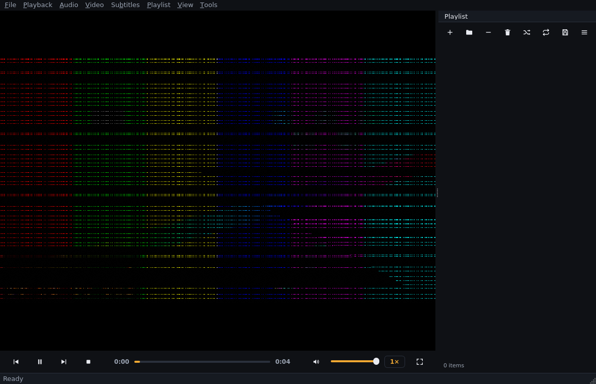

# Phase 8 — Engineering notes (2026-09-18)

## What was added

- **Audio track selection** — new `&Audio` menu: exclusive, dynamically
  populated (language/codec labels, e.g. "FRE (AAC)"), with a *Disabled*
  entry; `B` cycles (off → tracks → off, mirroring `J` for subtitles) with
  status-bar feedback.
- **Video track selection** — new `&Video` menu: exclusive track list with
  dimensions in the label ("Bonus video (MPEG4) — 160×90"), *Disabled*
  entry, plus **Take Screenshot** (`S` — the key was reserved since Phase 2).
- **Secondary subtitle track** — a "Secondary Track" submenu in the Subtitles
  menu: shows a subtitle track *in addition* to the primary one
  (`secondary-sid` in the engine); per-file, starts cleared.
- **Audio sync** — `Audio Sync` submenu plus keys: `-` earlier / `+` (or `=`)
  later, 50 ms steps (VLC-style), `Shift+-` resets; live status readout
  ("Audio delay: +0.10 s"); the offset persists across files in a session,
  exactly like subtitle delay since Phase 5.
- **Screenshots** — `screenshot-to-file` (frame + subtitles) to
  Pictures/Lumen, falling back to `<config>/screenshots`; timestamped,
  collision-suffixed filenames; failures surface as a status message and a
  log entry, never an exception.
- **Per-file track selection policy** — every newly loaded media resets
  audio/video/subtitle selection to the engine's defaults (see below for the
  trap this closes).

## Engine facts verified this phase (libmpv 0.40)

| Fact | Consequence |
|---|---|
| Track ids are **per-kind namespaces** (audio 1..n, video 1..m, sub 1..k) | menus and the backend speak per-kind ids, like `sid` since Phase 5 |
| Selecting an id **missing from the file disables the track type** (readback `False`), no exception | documented engine quirk; menus build ids from the engine's own list, so invalid ids can't come from the UI |
| `aid`/`vid` accept `"auto"`; auto → default-flagged track | enables the per-file reset policy |
| **Numeric aid/vid persist across `loadfile`** (aid=2 stayed 2; aid=False stayed disabled) | without an explicit reset, stale ids leak into the next file — the trap the policy closes |
| `secondary-sid` round-trips (int ⇄ `False`); `secondary-sub-visibility` defaults to `True` | secondary subs are selection-only; no extra plumbing |
| `audio-delay` is runtime-settable, reads back exactly, and **persists across `loadfile`** | same session-scoped semantics as `sub-delay` (Phase 5) |
| `screenshot-to-file <path> subtitles` works under **both** vo=null and vo=libmpv+render-API (verified under Xvfb/GL) | backend endpoint is testable headless; frame includes subtitles |

## Design decisions

1. **Track selections are per-file** (`PlayerController._apply_per_file_track_policy`,
   a GUI-thread slot connected to its own queued `mediaLoaded` signal — engine
   callbacks must not call back into the backend). Rationale: a stale numeric
   id silently *mutes* the next file (probe table above); VLC behaves the
   same way (fresh selection per input). Applies uniformly to audio, video,
   primary and secondary subtitles, including "Disabled" — a new file is a
   fresh start.
2. **One policy, one place**: the reset lives in the controller, not the
   backend's `open()` — the backend stays a dumb engine wrapper, and the
   policy is testable (`test_track_selection_resets_per_file`).
3. **Audio-delay nudging reuses the Phase 5 subtitle-delay plumbing** (signal
   → status bar; step constants in the UI layer). Audio sync is *not* in the
   settings dialog: it is a per-session, per-material correction, not a
   preference.
4. **Screenshots go through the controller** (`screenshot(directory)` builds
   the timestamped path, guards against unwritable directories, returns
   `Path | None`); the *directory choice* (Pictures vs config) is a
   UI/platform concern and lives in the main window — testable via
   monkeypatching.

## Bug fixes made while verifying (root causes, not workarounds)

### 1. `release()` violated the render API's threading contract (segfault)

Symptom: rare (≈1 in 3 full-suite runs) segfault during a test teardown —
faulthandler showed an mpv-internal C thread crashing while the main thread
was inside `mpv_render_context_set_update_callback` (via
`context.update_cb = None`) immediately before `context.free()`.

Root cause: render.h states that `mpv_render_*` calls must not run
concurrently and that setting the update callback **"will raise an update
callback immediately"**. python-mpv turns `update_cb = None` into a *newly
registered no-op wrapper* (it cannot pass NULL), so teardown triggered the
immediate-callback path and raced `free()` on mpv's internal thread — a
C-level use-after-free.

Fix (`app/player/mpv_surface.py`): teardown never touches the callback
registration anymore. A `_released` flag makes `_schedule_update` a silent
no-op (also guarding against Qt signal emission on a half-destroyed widget),
then the context is simply freed. Verified: 7+ consecutive full-suite runs
without a segfault.

### 2. `normalize_sequence` destroyed the `+` key binding

Symptom: the shortcut round-trip unit test failed after binding `+` —
`"+".split("+")` is all separators, so the sequence normalised to the empty
string. Investigation with `QKeySequence` showed: `"+"` and `"Ctrl++"` parse
correctly, while the tokens `"Plus"`/`"Shift+Plus"`/`"Ctrl+Equal"` produce
**invalid** sequences. Fix: a lone or trailing `+` is preserved as the key
itself; `ShortcutConfig.defaults()` now canonicalises once so the declared
table stays human-readable. Documented in the normaliser's docstring.

### 3. `test_seek_shortcuts` raced the end of its 4-second clip

Symptom: ~1 failure per full-suite run under load (also seen once in Phase 7
debugging). The test pumped to `position ≥ 0.4`, then seeked +5 s — if box
load let playback advance past ~1 s before the pump observed it, the seek
landed past EOF and `start + 3.0` became unsatisfiable. Fix: the test now
uses a dedicated 10-second clip (`long_sample_media` fixture) so the seek
math can never reach the end of the file. (Same class of fix as the Phase 7
`test_next_and_previous_navigation` pump fix: asserting engine state without
pumping races the engine.)

## Verification status

| Suite | Result |
|---|---|
| `ruff check app tests` | clean |
| `tests/core tests/player` | **152 passed** (10 new track/sync/screenshot contract tests + 1 shortcuts test) |
| `tests/ui` (full, default order) | **75 passed** — 3 consecutive runs after the fixes (67 Phase 7 + 8 new) |
| **Total** | **227 passed** |

New coverage includes: per-kind track listing with languages, audio/video
selection round-trips, the invalid-id→disable quirk, `reset_track_selections`,
secondary-subtitle round-trip, audio-delay round-trip + persistence across
`loadfile`, screenshot success + clean failure, Audio/Video menu behaviour
(list, select, check state), `B` cycling, the per-file reset policy, audio
sync keys with status feedback, and screenshot-on-`S` with a monkeypatched
directory.

Video-pixel verification on real GPU hardware remains open (llvmpipe
limitation, Phase 2 notes) — not a code defect.

## Known limitations

- Track menus show engine-provided labels: languages appear as ISO 639-2
  codes ("FRE"), not full names ("French") — an optional Phase 12 polish.
- Secondary subtitles have no dedicated delay or visibility controls
  (engine supports `secondary-sub-delay`; not exposed — YAGNI until asked).
- Audio sync applies to the session, not per-file (deliberate; matches
  subtitle-delay semantics).
- No screenshot of the *window chrome* (frame-only screenshots; VLC-style
  window capture is not offered).
- Software-GL user warning banner still planned (Phase 12).

## Next step

Phase 9 — streaming: URL opening (the controller already accepts URIs),
network error mapping (`NETWORK_FAILED`/`TIMEOUT` codes exist since Phase 1),
stream metadata (icy-title / HLS), buffering state in the UI, and a
"Open URL…" dialog (`Ctrl+U`, binding already reserved-able via the
configurable shortcuts file).
