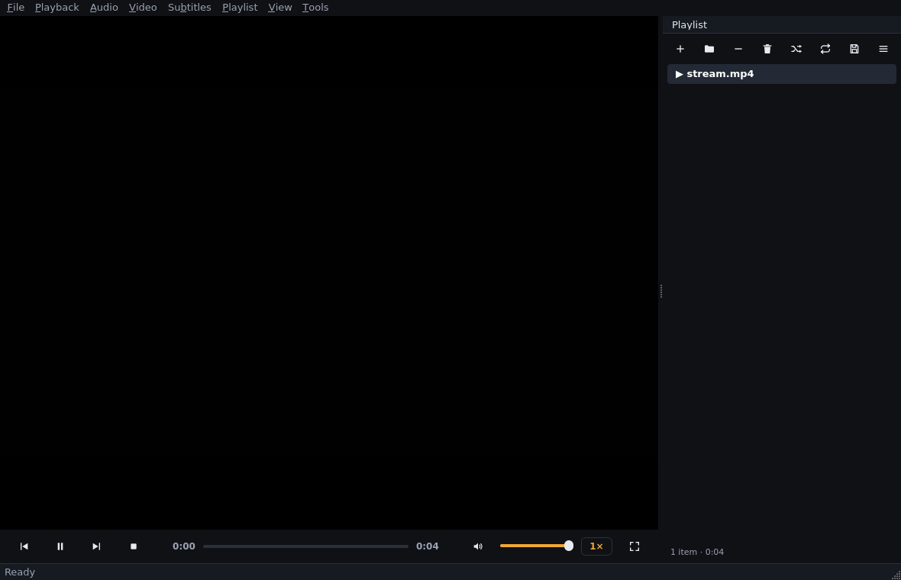

# Phase 9 — Engineering notes (2026-09-18)

## What was added

- **Open URL… dialog** (`Ctrl+U`, File menu): modal, with live scheme
  validation (http, https, rtsp, rtsps, rtmp, udp, rtp, mms, ftp — a
  whitelist; the Open button stays disabled for anything else). URLs open
  with Open-File semantics: replace the playlist, play, land in Recent Files.
  Dropped URLs (P4) and URLs inside M3U playlists (P4) keep working.
- **Buffering indicator** — an on-video "Buffering… n%" badge that appears
  while a stream's cache is filling or has run empty, driven by the engine's
  `cache-buffering-state` and `paused-for-cache` observations (fully
  event-driven; no polling).
- **ICY stream titles** — Shoutcast/Icecast "StreamTitle" metadata is
  observed and reflected live in the window title ("Show — Lumen") and the
  status bar ("Now playing: …").
- **Network error mapping** — the gap between libmpv's generic end-file
  report and the real cause is closed:
  | Situation | Engine evidence (verified) | User error code |
  |---|---|---|
  | Connection refused | log: `tcp: … Connection refused` (error level) | `NETWORK_FAILED` |
  | HTTP 404 | log: `http: HTTP error 404 File not found` (warn level) | `FILE_NOT_FOUND` |
  | Unroutable host / stall | log: `Connection timed out` / `timeout` | `TIMEOUT` (now actually used) |
  | Unstreamable layout | `Cannot seek backward in linear streams` → `partial file` / `no audio or video data played` | `UNSUPPORTED_FORMAT` |

## Engine facts verified this phase (libmpv 0.40)

| Fact | Consequence |
|---|---|
| HTTP playback works end-to-end; `path` = URL, `filename`/`media-title` = last path segment, `duration`/`track-list` populated like local files | streams are first-class media; info dialog works unchanged |
| **end-file carries only `file_error: "loading failed"`** — the real cause arrives as a *log* event (error level for TCP failures, **warn level for HTTP 404**) | classification needs the recent error-log ring buffer (now cleared on every `open()` so entries describe only the current attempt) |
| The causal log event may be **queued behind the end-file event** (race observed: same test passed/failed run-to-run) | unclassified errors get a 150 ms grace period before reporting — see design decisions |
| `metadata` observation delivers ICY titles on change (alternating titles verified against a hand-rolled icecast emulation); the standalone `icy-title` property does **not** update | stream titles come from `metadata`, not `icy-title` |
| `cache-buffering-state`: `None` (idle) or 0–100; `paused-for-cache`: bool; a fast local stream may never stall | the UI signal is change-driven and can legitimately never fire |
| **A non-faststart MP4 cannot be demuxed over rangeless HTTP** (`moov` at file end → "Cannot seek backward in linear streams") | test media must be faststart; classified as unsupported/damaged |
| mpv's ytdl hook tries to fetch *any* http URL when enabled (seen in probe logs) | `ytdl=no` stays (set since Phase 2); page URLs like youtube.com are deliberately not supported |

## Design decisions

1. **Error reporting has a 150 ms grace period** (`_report_open_error_deferred`).
   When end-file yields only UNKNOWN, the report is deferred by a
   cancellable `threading.Timer`: if the causal log line lands within the
   grace window, the error is re-classified (404 → FILE_NOT_FOUND etc.);
   otherwise the original is reported. Timers are cancelled by `open()` and
   `shutdown()`, so a new attempt can never surface a stale error. Known
   codes are still reported immediately — only genuinely unknown failures
   pay the 150 ms.
2. **Buffering is one consolidated signal**, `on_buffering_changed(percent |
   None)`, derived from the two engine observations: `None` = not buffering,
   `0..99` = buffering at that fill, a stall with unknown fill reports `0`.
   Emits only on change (no 16 Hz chatter). Not part of `PlaybackState` —
   buffering is orthogonal to play/pause and a new enum state would ripple
   through every consumer for no benefit.
3. **Scheme whitelist, ytdl stays off** — URLs are untrusted input; the
   dialog rejects anything that is not a direct media/stream address before
   it reaches the engine, and the engine is barred from shelling out to
   yt-dlp (which would otherwise spawn a subprocess with user-controlled
   arguments — against the project's security rules).
4. **Stream titles update window title + status bar**, not the playlist row:
   the row keeps the stable URL-derived name; the live title is ephemeral
   state of the *current* play (same choice VLC makes).
5. **Per-test config isolation** (`tests/ui/conftest.py`, autouse): every UI
   test gets its own `LUMEN_CONFIG_DIR` — the same hermeticity settings
   gained in Phase 7, now covering `recents.json` too. Found via a recents
   assertion that raced `mediaLoaded` delivery across a shared file.

## Test infrastructure notes

- All stream tests run against **local HTTP servers** (no external network):
  a plain server for playback, a fast-then-stall server that forces a real
  cache underrun (buffering → resume verified end-to-end), a 404 server,
  and a ~60-line **icecast emulation** (MP3 + interleaved ICY metadata
  blocks) that produces genuine alternating stream titles.
- The buffering *derivation* is additionally unit-tested with simulated
  engine observations (including the transitional paused-with-full-cache
  state → reported as 0).

## Verification status

| Suite | Result |
|---|---|
| `ruff check app tests` | clean |
| `tests/core tests/player` | **160 passed** (8 new stream contract tests) |
| `tests/ui` (full, default order) | **82 passed — 3 consecutive runs** (75 + 7 new) |
| **Total** | **242 passed** |

New coverage: HTTP playback (tracks/duration/details), refused → network
error (with the engine's line in the detail), 404 → not found, ICY title
updates (both titles), a real stall → buffering + resume, derivation unit
tests, classifier unit tests, dialog validation (scheme whitelist, no-host,
no-scheme, `file://`/`javascript:` rejection), dialog accept/cancel flows,
Ctrl+U end-to-end playback, recents integration, buffering badge
show/percent/hide, stream-title window/status reflection.

Video-pixel verification on real GPU hardware remains open (llvmpipe
limitation, Phase 2 notes) — not a code defect.

## Known limitations

- Unroutable hosts rely on the engine's `network-timeout` (30 s default):
  the UI shows the loading state until mpv gives up — a shorter, app-chosen
  timeout plus a cancel button is Phase 10/12 UX material.
- Live streams with unknown duration show a disabled seek bar (engine
  reports no duration) — expected, matches VLC.
- Container names for streams show ffmpeg's raw format list (e.g.
  `mov,mp4,m4a,3gp,3g2,mj2`) in the info dialog — Phase 12 polish.
- ICY title updates don't rewrite the playlist row title (by design, see
  decisions).
- No proxy authentication UI (engine-level proxy options exist if ever
  needed).

## Next step

Phase 10 — performance: startup time measurement and budget, playlist model
incremental updates (currently full resets on structural changes), seek
smoothness under load (position-emit throttling is in place; verify under
CPU pressure), memory/leak pass over a long-running session (the Phase 7/8
teardown work laid the groundwork), and lazy menu population where it pays.
